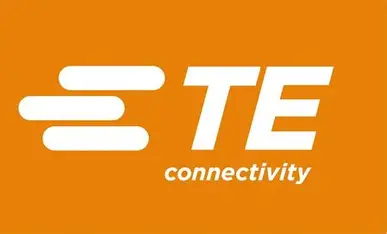

  

# 👋 Hello, I’m Shrikar Ramesh

**CO-OP / Intern**

T.E Connectivity India

  

---

## 📌 Summary

I am currently working as a CO-OP/Intern at T.E Connectivity India, contributing to engineering and technology initiatives with a focus on practical implementation and continuous learning. I strive to support projects that improve operational efficiency, product reliability, and connectivity solutions.

## 🎯 Professional Focus

- Engineering support for product development and connectivity systems
- Automation and process improvement
- Data-driven problem solving and technical analysis
- Collaboration with cross-functional teams to deliver quality outcomes

## 🧰 Skills

- Technical documentation and communication
- Microsoft Office and productivity tools
- Basic programming and scripting concepts
- Engineering teamwork and project coordination

## 💼 Experience

- CO-OP / Intern at T.E Connectivity India
  - Supporting daily engineering tasks
  - Assisting with documentation, testing, and process tracking
  - Learning industry-standard practices and quality requirements

## ✉️ Contact

- GitHub: [@ShrikarxTE](https://github.com/ShrikarxTE)
- Email: shrikar.ramesh@te.com

---

Thank you for visiting my profile.
